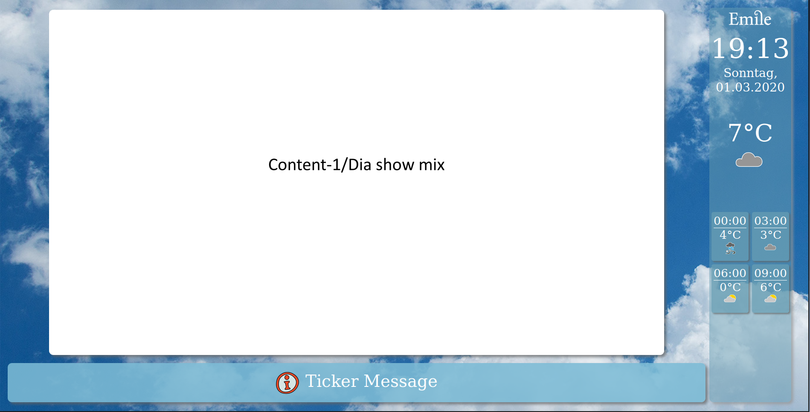
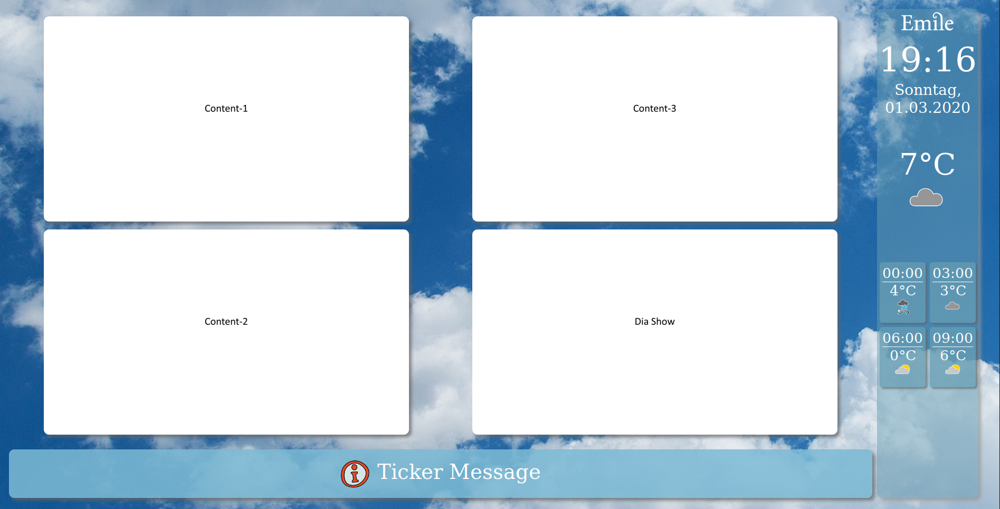

# Info Screen

This project was generated with [Angular CLI](https://github.com/angular/angular-cli) version 8.1.3.

This application implements an info screen for a school.
It works in combination with the dedicated http server [`infoscreenservice`](https://github.com/mua69/infoscreenservice).

The info screen display consists of following elements:
* right bar with time, date and weather information
* bottom bar with a single line ticker display short text messages
* content area showing either 1 or 4 (2x2) independent image sequences 

In single content image mode the content image sequence may be intermixed with a dia show image sequence at a configurable rate. 

Configuration and content supply is handled by the `infoscreenservice` application. See its [documentation](https://github.com/mua69/infoscreenservice/README.md) for details.

This application has been tested with Firefox but should work with other browsers as well - 
just some fine tuning of the widget sizes for full screen mode may be required.
It is recommended to use a full screen plugin for the browser like "MPT Fullscreen" for Firefox.

## Examples

###Single content mode:

###2x2 content mode:

## Build

1. Install latest nodejs release from https://nodejs.org/.
1. Clone this package: `git clone https://github.com/mua69/infoscreenapp.git`
1. Enter package directory.
1. Install dependencies: `npm install`
1. Build application: `./node_modules/.bin/ng build --prod`
1. Build artifacts will be stored in the `dist/` directory.

## Development server

Run `./node_modules/.bin/ng serve` for a dev server. Navigate to `http://localhost:4200/`.
The app will automatically reload if you change any of the source files. 

Since in development mode the application is not served by the `infoscreenservice` the URL for accessing the `infoscreenservice`
api endpoints must explicitly set in `config.service.ts` function `url()`. 
